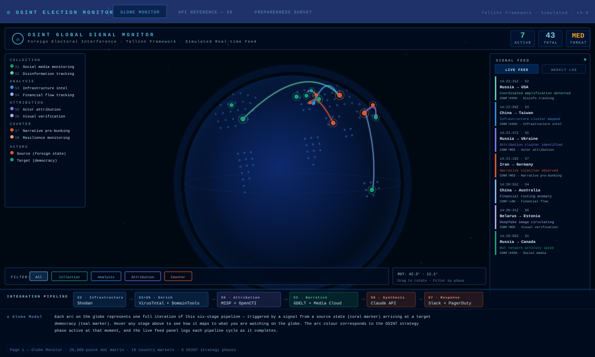
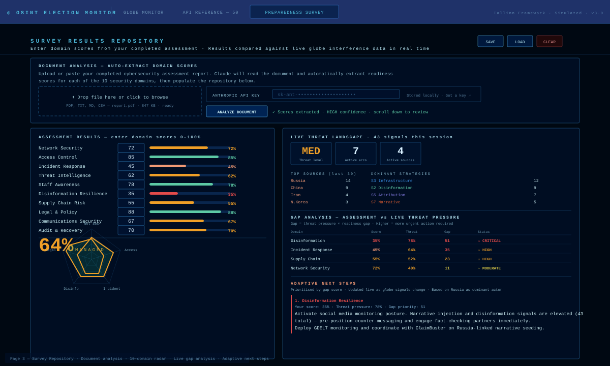

# OSINT Global Signal Monitor

A self-contained, single-file intelligence tool for monitoring and analysing foreign electoral interference. Built for analysts, researchers, and election security practitioners. No build step, no backend, no dependencies beyond a CDN-loaded Three.js.

   

---

## Screenshots

### Page 1 — Globe Monitor


A real-time 3D signal globe showing simulated foreign interference operations. 20,000-point Fibonacci dot-matrix earth, 18 country markers (6 source states, 12 target democracies), animated signal arcs coloured by OSINT strategy phase, live signal feed with weekly log toggle, threat level counter, and a full integration pipeline strip at the bottom — hover any stage to see how it maps to what you are watching on the globe.

---

### Page 2 — API Reference


Searchable, filterable reference for 50 APIs mapped across 8 OSINT strategies and 4 phases (Collection, Analysis, Attribution, Counter/Response). Tier Realities (11 Free / 21 Freemium / 18 Commercial) and Legal Obligations (GDPR, Tallinn Rules) are pinned at the top. Click any row to expand endpoint and documentation link.

---

### Page 3 — Survey Results Repository


Upload or paste a completed cybersecurity assessment report — Claude reads it and auto-extracts readiness scores for 10 security domains. Scores populate a radar chart and are cross-referenced live against the globe's interference signal stream, producing a gap analysis table and adaptive next steps that update in real time as new signals appear.

---

## Deployment

### GitHub Pages (recommended)

1. Fork or clone this repository
2. Rename `osint_globe.html` → `index.html` if needed (or configure Pages to use a custom filename)
3. Go to **Settings → Pages → Source → Deploy from branch → main / root**
4. Your site will be live at `https://<your-username>.github.io/<repo-name>/`

No npm, no build step, no server.

### Local

```bash
# Any static server works — Python example:
python3 -m http.server 8080
# Then open http://localhost:8080
```

Or open `index.html` directly in a browser. The globe and all three pages work offline. The only feature that requires a network connection is document analysis on Page 3 (Anthropic API call).

---

## API key setup (Page 3 document analysis)

The document analysis feature calls the Anthropic Claude API directly from the browser.

1. Get a key at [console.anthropic.com/settings/keys](https://console.anthropic.com/settings/keys)
2. On Page 3, paste your key into the **ANTHROPIC API KEY** field in the Document Analysis section
3. The key is saved to `localStorage` — it is never sent anywhere except directly to `api.anthropic.com`

The fetch call uses:
```
x-api-key: <your key>
anthropic-version: 2023-06-01
anthropic-dangerous-allow-browser: true
```

The `anthropic-dangerous-allow-browser` header is required for direct browser-to-API calls and is documented by Anthropic — see [client-side usage](https://docs.anthropic.com/en/api/getting-started).

> **Security note:** Never commit your API key to the repository. The field is a password input and keys are stored only in the local user's own browser storage.

---

## Architecture

```
osint_globe.html / index.html   (~950 lines, single file)
├── <style>
│   ├── Nav bar, page containers, panel base styles
│   ├── Globe HUD: header, legend, feed, filters, pipeline
│   ├── API reference: table, filter pills, expand rows
│   └── Page 3: repo layout, score inputs, doc drop zone
│
├── Page 1 HTML — Globe HUD
│   ├── #header       brand + ACTIVE / TOTAL / THREAT counters
│   ├── #legend       strategy phase + actor key
│   ├── #feed         live ticker + weekly log tab toggle
│   ├── #filters      phase filter buttons
│   ├── #coords       rotation display
│   └── #pipeline     node strip + hover description row
│
├── Page 2 HTML — API Reference
│   ├── Tier Realities + Legal Obligations cards (top)
│   ├── Search input + phase/tier filter pills
│   ├── Column headers
│   └── #alist        dynamically rendered API rows
│
├── Page 3 HTML — Survey Repository
│   ├── Document analysis: drop zone + paste + API key field
│   ├── #repo-scores  10 domain score inputs + progress bars
│   ├── #repo-radar   SVG radar chart (refreshes on input)
│   └── #repo-threat  live threat landscape + gap analysis + next steps
│
└── <script>
    ├── showPg()            Page switching + globe resize fix
    ├── Globe / Three.js    20k dot matrix, markers, arcs, animation loop
    ├── Feed system         Live ticker + weekly log (grouped by sim day)
    ├── ppHover()           Pipeline stage explanations on hover
    ├── Survey repository   Domain scores, gap analysis, adaptive next steps
    ├── runDocAnalysis()    Anthropic API call + JSON extraction + auto-populate
    └── API reference       APIS[] data array + filter/search/expand render
```

**External dependency:** `three.min.js r128` from `cdnjs.cloudflare.com`. To vendor it locally for offline/air-gapped deployment:

```html
<!-- In <head>, replace: -->
<script src="https://cdnjs.cloudflare.com/ajax/libs/three.js/r128/three.min.js"></script>
<!-- With: -->
<script src="./three.min.js"></script>
```

Download from: `https://cdnjs.cloudflare.com/ajax/libs/three.js/r128/three.min.js`

---

## Customisation guide

### Adding a source or target country

In the `CY` object (~line 270):

```javascript
const CY = {
  // existing entries...

  // New SOURCE country (foreign state conducting interference):
  newstate: { lat: 48, lon: 68, name: 'New State', t: 'src' },

  // New TARGET democracy:
  newdemocracy: { lat: -34, lon: 151, name: 'New Democracy', t: 'tgt' },
};
```

Add the source country to `swt` (signal weight) to control arc frequency:

```javascript
const swt = {
  russia: 4, china: 4, iran: 2, nkorea: 2, belarus: 2, venezuela: 1,
  newstate: 3,   // weight 1–4 relative to others
};
```

---

### Adding an OSINT strategy

In the `ST` array (~line 271):

```javascript
const ST = [
  // existing strategies...
  {
    id: 9,                          // next sequential ID
    name: 'Satellite imagery',      // display name
    phase: 'attribution',           // collection | analysis | attribution | counter
    color: '#C878E8',               // arc and feed entry colour (hex)
    c3: 0xC878E8,                   // same colour as Three.js hex integer
  },
];
```

The legend builds automatically from `ST` — no further changes needed.

---

### Adding an API to the reference table

Each entry in the `APIS` array (~line 620):

```javascript
[
  id,           // integer — next sequential number
  "API Name",
  "Provider",
  "phase",      // col | ana | att | ctr
  [strategies], // strategy IDs this API serves, e.g. [1, 2]
  "tier",       // free | frm | com
  "endpoint",   // base URL without https://
  "Use case — semicolons separate points",
  "docs.url.without.https",
]
```

Example:

```javascript
[51, "Shodan Monitor API", "Shodan", "ana", [3], "frm",
 "api.shodan.io/shodan/alert",
 "Continuous monitoring of specific IPs and networks; alert triggers on port or service changes; election infrastructure watch lists",
 "developer.shodan.io/api/shodan-alert"],
```

---

### Adding a security domain to Page 3

Update six objects (~line 390):

```javascript
// 1. Add the domain ID
const DIDS = ['net','iam','ir','ti','aw','dis','sc','lp','cs','ar', 'newdomain'];

// 2. Full display name
const DNAMES = { ..., newdomain: 'New Domain Name' };

// 3. Weighting for overall score (1.0 = standard)
const DWTS = { ..., newdomain: 1.0 };

// 4. Short label for radar chart
const DSHORT = { ..., newdomain: 'NewDom' };

// 5. Globe strategy IDs (S1–S8) that threaten this domain
const DTM = { ..., newdomain: [3, 5] };

// 6. Context-aware action template
const CTX_ACTIONS = {
  ...,
  newdomain: (src, n) => `Action recommendation referencing ${src} and ${n} signals.`,
};
```

Radar chart, gap table, and next steps all update automatically.

---

### Changing the document analysis prompt

`ANALYSIS_PROMPT` (~line 765) defines what Claude extracts and how it scores. Modify scoring guidance or add/remove domains here. The prompt requires pure JSON output — keep that constraint in place or update the `JSON.parse` call accordingly.

---

### Swapping the AI model

In `runDocAnalysis()`:

```javascript
model: 'claude-sonnet-4-20250514'   // current
model: 'claude-haiku-4-5-20251001'  // faster / cheaper
model: 'claude-opus-4-6'            // maximum capability
```

Current model IDs: [docs.anthropic.com/en/docs/about-claude/models](https://docs.anthropic.com/en/docs/about-claude/models)

---

### Adjusting signal spawn rate

In the `tick()` animation loop:

```javascript
const INTERVAL = 2100;    // ms between base signal spawns — lower = faster

// After each base signal, 22% chance of a burst:
if (Math.random() < 0.22) {          // raise for more bursts
  setTimeout(spawnSignal, 480);
  if (Math.random() < 0.4)           // second burst probability
    setTimeout(spawnSignal, 960);
}
```

---

### Threat level thresholds

In `tick()`:

```javascript
if (act > 7)       { th.textContent = 'HIGH'; ... }  // active arcs
else if (act > 3)  { th.textContent = 'MED';  ... }
else               { th.textContent = 'LOW';  ... }
```

---

## Signal feed and weekly log

The live feed shows the last 10 signals as a scrolling ticker. Toggle to **Weekly Log** to see all session signals grouped by simulated day — each real minute = one simulated day, building Mon–Sun from the actual current calendar week. CLR wipes both. Signal data is in-memory and does not persist across page reloads.

---

## Doctrinal and framework references

| Domain | Framework |
|---|---|
| Signal confidence tiers | ODNI Intelligence Community Directive 203 |
| Attribution standards | Tallinn Manual 3.0, Rules 30–37, 84 (NATO CCDCOE 2023) |
| Disinformation typology | EU EEAS FIMI Threat Landscape Report 2023 |
| IO taxonomies | Stanford Internet Observatory |
| Security domain scoring | NIST CSF 2.0, CISA Election Security Risk Management Framework |
| Gap analysis risk matrix | ISO/IEC 27005:2022 |
| Incident response benchmarks | NIST SP 800-61r3 |
| Supply chain risk | NIST SP 800-161r1 |
| Threat intelligence sharing | STIX 2.1 / TAXII 2.1 (OASIS) |

---

## Browser support

Chrome 120+, Firefox 122+, Safari 17+, Edge 120+. Requires WebGL for the globe. Pages 2 and 3 remain fully functional if WebGL is unavailable.

---

## Suggested repository structure

```
your-repo/
├── index.html             (rename from osint_globe.html)
├── README.md
├── screenshots/
│   ├── page1-globe.svg
│   ├── page2-api-reference.svg
│   └── page3-survey-repository.svg
└── three.min.js           (optional — only needed for offline/air-gapped)
```

---

## License

MIT. Free to use, modify, and deploy. Attribution appreciated but not required.

If you use this in published research or operational security work, consider citing the frameworks in the reference table — they are the intellectual foundation of the methodology.

---

## Contributing

Pull requests welcome. Priority areas:

- **Real API integration** — replacing simulated signals with live GDELT, OTX, or Shodan feeds
- **Expanded land detection** — replacing the `isLand()` bounding-box approximation with proper GeoJSON
- **Export** — PDF or JSON export of weekly log and gap analysis
- **Authentication layer** — optional password protection for sensitive deployments
- **Localisation** — translating the interface for non-English election security teams

Open an issue before starting large changes.
